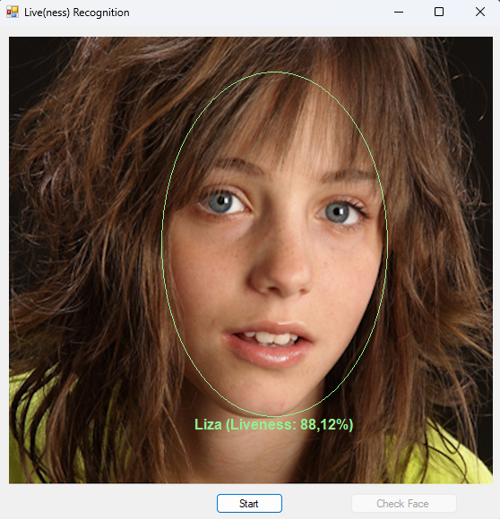
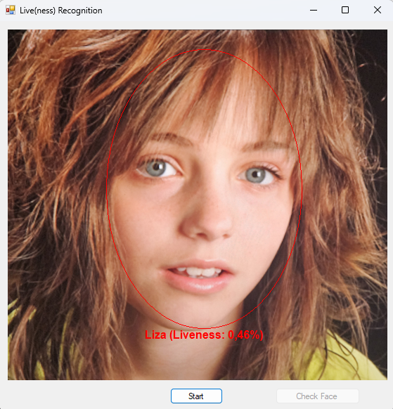

## [FaceSDK](https://www.luxand.com/facesdk/?utm_source=github&utm_medium=readmd&utm_campaign=header) · [CloudAPI](https://luxand.cloud/?utm_source=github&utm_medium=readmd&utm_campaign=header) · [LinkedIn](https://www.linkedin.com/company/luxand-inc.) · [Contact](mailto:support@luxand.com)


<table style="border-collapse: collapse; border: none;">

 

### NIST-approved

Luxand's FaceSDK ranked within the top 21.8% by the National Institute of Standards and Technology (NIST) during the Face Recognition Vendor Test (FRVT).


### iBeta Certified Liveness

The iBeta certified Liveness add-on for FaceSDK aced Level 1 Presentation Attack Detection (PAD) testing, following ISO/IEC 30107-3 standards. 

# FaceSDK \- C#, Windows

##   

## Samples

Live face recognition with liveness detection from a webcam, using Luxand FaceSDK 9.0 and the [iBeta Certified Liveness Addon](https://www.luxand.com/facesdk/documentation/certifiedliveness.php):

- `LiveRecognitionWinForms` &mdash; Windows Forms application (.NET Framework 4.8), solution `LiveRecognitionWinForms/LiveRecognition_VS2010+.sln`
- `LiveRecognitionWinUI` &mdash; WinUI 3 application (.NET 8, Windows App SDK), solution `LiveRecognitionWinUI/LiveRecognitionWinUI.sln`

Both samples use the `FaceSDK.NET` wrapper built from the sources in `fsdk/`. The native FaceSDK library, the iBeta add-on and its data files are in `fsdk/binaries` and are copied next to the executable after the build.

Recognized faces are stored in the tracker memory file `tracker90.dat`. Click a face to assign a name to it.

### Getting Started

1. Install the iBeta license (see [iBeta License](#ibeta-license)).
2. Open a solution in Visual Studio 2022 or later.
3. Replace `INSERT THE LICENSE KEY HERE` with your license key in the `FSDK.ActivateLibrary` call (`LiveRecognitionWinForms/MainForm.cs` or `LiveRecognitionWinUI/MainWindow.xaml.cs`).
4. Select the `x64` platform, build and run.

## FaceSDK 9.0 API

FaceSDK 9.0 uses new neural network models for face detection and recognition. The face template size is 1040 bytes (`FSDK.TemplateSize`). Templates and tracker memory files created with FaceSDK 8.x are not compatible with 9.0.

```c#
public struct TFace
{
    public float score;      // detection confidence, 0..1
    public float angle;      // in-plane rotation angle, degrees
    public BBox bbox;        // bbox.p0 - top left, bbox.p1 - bottom right corner
    public TPoint[] features; // 5 points: eye centers, nose tip, mouth corners

    public TPoint center;    // center of the bounding box
    public int width, height;
}
```

*`TFace` replaces the `TFacePosition` structure of previous versions. The 70 facial features are returned as `TPointF[]` (floating point coordinates).*

```c#
Luxand.CImage image = new Luxand.CImage(imagePath);
FSDK.TFace face = image.DetectFace();
```

*Detects a single face on the given image. If multiple faces are present, the function returns the one with the highest confidence.*

```c#
FSDK.TFace[] faces = image.DetectMultipleFaces();
```

*Detects multiple faces on the given image. The faces are sorted by confidence in descending order.*

```c#
FSDK.TPointF[] features = image.DetectFacialFeaturesInRegion(face);
```

*Detects 70 facial features of the given `face`.*

```c#
byte[] faceTemplate = image.GetFaceTemplate();
byte[] faceTemplate = image.GetFaceTemplateInRegion(face);
FSDK.MatchFaces(faceTemplate1, faceTemplate2, out float similarity);
```

*Obtains a face template for the face with the highest confidence on the image, or for the given `face`, and matches two templates.*

### Configuring Face Detection and Recognition

Parameters are set using the `FSDK.SetParameter` or `FSDK.SetParameters` functions (see [documentation](https://www.luxand.com/facesdk/documentation/configuration.php)). For the Tracker API use `tracker.SetParameter` / `tracker.SetMultipleParameters`. The main parameters are listed below.

#### Face Detection

| Parameter | Description | Default Value | Accepted Values |
| :---      | :---        |     :---:     | :---            |
| FaceDetectionThreshold | Minimum detection score for a face to be reported | 0.64 (Tracker: 0.4) | Floating point value from the range [0, 1] |
| FaceDetectionPatchSize | Size of the square patch the detector works with | 640 (Tracker: 256) | Divisible by 32, minimum 64. Higher values decrease performance, but allow detection of smaller faces |
| FaceDetectionPatchMode | Image patching algorithm to use | fast | <p>`"fast"` &mdash; resizes the image to a single patch</p> <p>`"full"` &mdash; tiles the whole image with patches, finds small faces in large images</p> <p>`"mixed"` &mdash; chooses between the two based on the ratio of the patch size to the image size</p> |
| FaceDetectionBigFaceSize | Size of the whole-image pass used to find faces too large for a single patch | 384 | Positive integer |
| FaceDetectionBatchSize | Number of image patches processed at the same time | 1 | Positive integer |
| TrimOutOfScreenFaces | Discard faces crossing the edges of the image | true | `"true"` or `"false"` |
| FaceDetectionModel | Path to the face detection model file to load | default | File path or the string `"default"` |

The samples use `FaceDetectionPatchSize=128` for live webcam video. Use 256 for still photos and 384 for large digital camera photos.

#### Face Recognition

| Parameter | Description | Default Value | Accepted Values |
| :---      | :---        |     :---:     | :---            |
| FaceRecognitionModel | Path to the face recognition model file to load | default | File path or the string `"default"` |
| FaceRecognitionUseFlipTest | Additionally use mirrored image when creating face template | false | `"false"` or `"true"` |
| FaceRecognitionBatchSize | Number of faces processed in one inference call | 1 | Positive integer |
| ComputationDelegate | Computation delegate for all models | cpu | <p>`"none"` &mdash; run on CPU without SIMD optimizations</p> <p>`"cpu"` &mdash; run on CPU with SIMD optimizations</p> <p>`"gpu"` &mdash; run on GPU</p> |

## Managing Face Templates in Tracker Memory

The following functions can be used to synchronize Tracker Memory between different devices.

Since the list of IDs in the Tracker may change during operation (for example, two IDs may be merged), it is not recommended to work with the Tracker (i.e., call `FSDK.FeedFrame`) while using the following functions. Also, you must call the following function beforehand (see [FAQ](https://www.luxand.com/facesdk/faq.php)):

```c#
FSDK.SetTrackerParameter(tracker, "VideoFeedDiscontinuity", "0");
```
Below is the list of functions for direct access to the Tracker Memory face templates.

```c#
int FSDK.GetTrackerIDsCount(int Tracker, out long Count);
```

*Returns the number of `IDs` (persons) in the Tracker's database.*

```c#
int FSDK.GetTrackerAllIDs(int Tracker, out long[] IDList, long MaxSizeInBytes);
```

*Returns a list of all the `IDs` in the Tracker.*

```c#
int FSDK.GetTrackerIDByFaceID(int Tracker, long FaceID, out long ID);
```

*Returns the person `ID` for the given `FaceID`. This function may be useful when the person `ID` changes during Tracker operation while the `FaceID` of the template remains unchanged, or when the `ID` is simply unknown. The `FaceID` always remains unchanged.*

```c#
int FSDK.GetTrackerFaceIDsCountForID(int Tracker, long ID, out long Count);
```

*Returns the number of face templates in the Tracker's database for the specified `ID` (person).*

```c#
int FSDK.GetTrackerFaceIDsForID(int Tracker, long ID, out long[] FaceIDList, long MaxSizeInBytes);
```

*Returns a list of all the `FaceIDs` for the specified `ID` (person).*

```c#
int FSDK.GetTrackerFaceTemplate(int Tracker, long FaceID, out byte[] FaceTemplate);
```

*Returns the face template for the specified `FaceID`.*

```c#
int FSDK.TrackerCreateID(int Tracker, byte[] FaceTemplate, out long ID, out long FaceID);
```

*Creates a new person `ID` and adds the provided template to it. Returns the new person `ID` and the associated `FaceID`.*

```c#
int FSDK.AddTrackerFaceTemplate(int Tracker, long ID, byte[] FaceTemplate, out long FaceID);
```

*Adds a new template to an existing person `ID` and returns the `FaceID`.*

```c#
int FSDK.DeleteTrackerFace(int Tracker, long FaceID);
```

*Deletes the face template with the specified `FaceID`. If this is the last template for the person, the person `ID` will also be removed.*

```c#
int FSDK.GetTrackerFaceImage(int Tracker, long FaceID, out int Image);
```

*Returns the face image handle for the specified `FaceID`. The dimensions are 112x112. Face images are stored when the `KeepFaceImages` Tracker parameter is `true`. If the image is not present, the function returns the error code `FSDKE_FACEIMAGE_NOT_FOUND`.*

```c#
int FSDK.SetTrackerFaceImage(int Tracker, long FaceID, int Image);
```

*Sets the face image for the specified `FaceID`. The dimensions of the provided `Image` must be 112x112. If an image already exists for the `FaceID`, it will be replaced.*

```c#
int FSDK.DeleteTrackerFaceImage(int Tracker, long FaceID);
```

*Deletes the face image for the specified `FaceID` from the Tracker's database.*

```c#
public struct IDSimilarity
{
    public long ID;
    public float Similarity;
}

int FSDK.TrackerMatchFaces(int Tracker, byte[] FaceTemplate, float Threshold, out IDSimilarity[] Buffer, long MaxSizeInBytes);
```

*Fills `Buffer` with person `IDs` from the Tracker's memory that have a face `similarity` score above the `Threshold`. Each entry contains the person `ID` and the respective face `similarity`. Entries are added in descending order, so the `ID` with the highest `similarity` score appears first.*

## iBeta Certified Liveness Addon

The samples use the [iBeta Certified Liveness Addon](https://www.luxand.com/facesdk/documentation/certifiedliveness.php) for single-frame presentation attack detection:

```c#
// Load the iBeta liveness add-on; its data directory is next to the executable
int res = FSDK.SetParameter("LivenessModel", "external:dataDir=" + AppContext.BaseDirectory);

tracker.SetMultipleParameters("FaceDetectionPatchSize=128; FaceDetectionThreshold=0.4;", out var errorPosition);
tracker.SetParameter("DetectLiveness", "true");
tracker.SetParameter("LivenessFramesCount", "1");
tracker.SetParameter("SmoothAttributeLiveness", "false");
```

`FSDKE_PLUGIN_NO_PERMISSION` (-31) means that your FaceSDK license key does not permit the iBeta add-on. If the add-on cannot be loaded, the samples show an error message and continue without iBeta liveness.

### iBeta License

The iBeta add-on requires a license file (`.v2c`) installed on the computer before starting the application. The license file and the install utility are in the `INSTALL_LICENSE` directory. To install it, run:

```bat
cd INSTALL_LICENSE
run_to_install_license.bat
```
