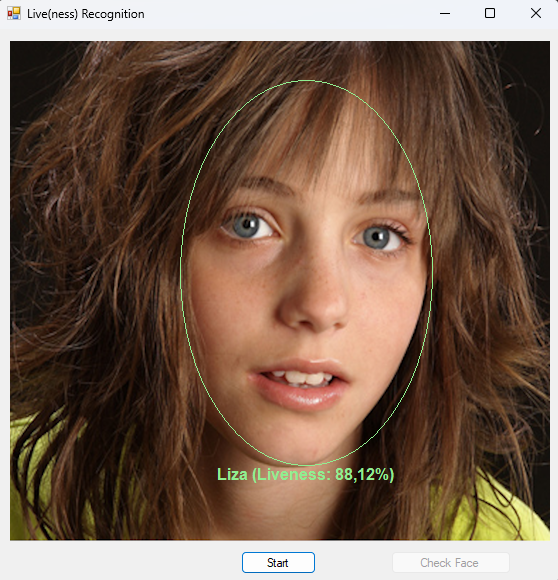
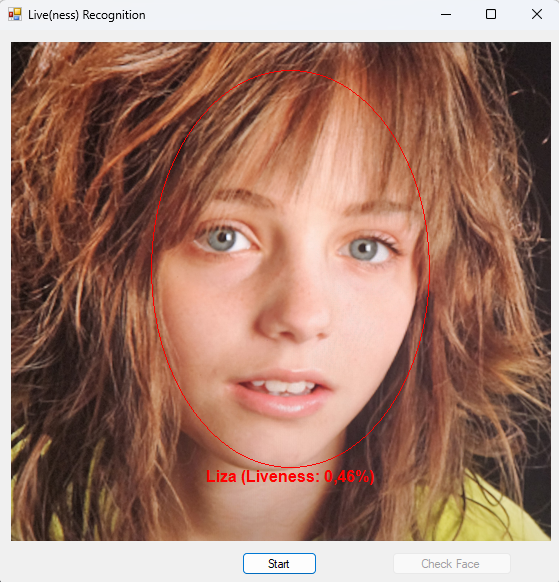

## [FaceSDK](https://www.luxand.com/facesdk/?utm_source=github&utm_medium=readmd&utm_campaign=header) · [CloudAPI](https://luxand.cloud/?utm_source=github&utm_medium=readmd&utm_campaign=header) · [LinkedIn](https://www.linkedin.com/company/luxand-inc.) · [Contact](mailto:support@luxand.com)


<table style="border-collapse: collapse; border: none;">

 

### NIST-approved

Luxand's FaceSDK ranked within the top 21.8% by the National Institute of Standards and Technology (NIST) during the Face Recognition Vendor Test (FRVT).


### iBeta Certified Liveness

The iBeta certified Liveness add-on for FaceSDK aced Level 1 Presentation Attack Detection (PAD) testing, following ISO/IEC 30107-3 standards. 

# FaceSDK \- C#, Windows

##   

## Improved Face Detection and Recognition

The accuracy of face detection and recognition is significantly improved. Note that the face template size has been increased to 2068 bytes and the recognition threshold has been reduced. Threshold values as low as 0.7-0.8 provide good results in our tests.

Use the following classes and functions to use the improved algorithms.

```c#
public struct TFace 
{
    public TPoint a, b;
    [MarshalAs(UnmanagedType.ByValArray, SizeConst = 5)]
    public TPoint[] features;
}
```

*Use `TFace` instead of `TFacePosition` class when working with improved face detection. Points `a` and `b` correspond to top left and bottom right corner coordinates of the face bounding box. `features` contain 5 points detected on the face: eye centers, nose and mouth corners.*

```c#
Luxand.CImage image = new Luxand.CImage(imagePath);
FSDK.TFace face = image.DetectFace2();
```

*Detects a single face on the given image. If multiple faces are present, the function returns the one with the highest confidence.*

```c#
FSDK.TFace[] facesArray = image.DetectMultipleFaces2();
```

*Detects multiple faces on the given image. The faces are sorted by confidence in descending order.*

```c#
byte[] faceTemplate = image.GetFaceTemplate();
```

*Obtains a face template for the face with the most confidence on the image (as returned by `DetectFace2` function). Note that the face template size is 2068 bytes.*

```c#
byte[] faceTemplate = image.GetFaceTemplateInRegion2(face);
```

*Obtains a face template for the given `face`. Note that the face template size is 2068 bytes.*

### Configuring Improved Face Detection and Recognition

Parameters of the improved face detection and recognition are set using the `FSDK.SetParameter` or `FSDK.SetMultipleParameters` functions (see [documentation](https://www.luxand.com/facesdk/documentation/configuration.php)). The available parameters are listed below.

#### Face Detection

| Parameter | Description | Default Value | Accepted Values |
| :---      | :---        |     :---:     | :---            |
| FaceDetection2Model | Path to the face detection model file to load | default | File path or the string `"default"` |
| FaceDetection2Threshold | Face detection threshold | 0.64 | Floating point value from the range [0, 1] |
| FaceDetection2BatchSize | Number of image patches processed at the same time for face detection | 1 | Positive integer |
| FaceDetection2PatchSize | Size of a single image patch | 640 | Positive integer. Higher values decrease performance, but allow detection of smaller faces |
| FaceDetection2PatchMode | Image patching algorithm to use | fast | <p>`"fast"` &mdash; resizes the image to `FaceDetection2PatchSize` and performs detection on a single patch</p> <p>`"full"` &mdash; splits the image into overlapping patches of size `FaceDetection2PatchSize` and performs detection on every patch separately combing the results afterwards</p> <p>`"mixed"` &mdash; if the image size is at least twice as big as `FaceDetection2PatchSize` chooses `"full"` otherwise chooses `"fast"` |
| FaceDetection2ComputationDelegate | Computation delegate to use for face detection | cpu | <p>`"none"` &mdash; run on CPU without SIMD optimizations</p> <p>`"cpu"` &mdash; run on CPU with SIMD optimizations</p> <p>`"gpu"` &mdash; run on GPU</p> <p>`"nnapi"` &mdash; run using [NNAPI](https://developer.android.com/ndk/guides/neuralnetworks)</p> |

#### Face Recognition

| Parameter | Description | Default Value | Accepted Values |
| :---      | :---        |     :---:     | :---            |
| FaceRecognition2Model | Path to the face recognition model file to load | default | File path or the string `"default"` |
| FaceRecognition2UseFlipTest | Additionally use mirrored image when creating face template | false | `"false"` or `"true"` |
| FaceRecognition2ComputationDelegate | Computation delegate to use for face recognition | cpu | <p>`"none"` &mdash; run on CPU without SIMD optimizations</p> <p>`"cpu"` &mdash; run on CPU with SIMD optimizations</p> <p>`"gpu"` &mdash; run on GPU</p> <p>`"nnapi"` &mdash; run using [NNAPI](https://developer.android.com/ndk/guides/neuralnetworks)</p> |

### Activating Improved Face Detection and Recognition in Tracker

To activate improved face detection and recognition in Tracker set `DetectionVersion` Tracker parameter to `2`

```c#
FSDK.SetTrackerParameter(tracker, "DetectionVersion", "2");
```

Note that this parameter cannot be set for a non-empty Tracker, i.e. it must be set before the first call to `FSDK.FeedFrame`. Additionally, face detection and recognition parameters (as described [above](#set-parameters-of-the-improved-face-detection-and-recognition)) can be set using the `FSDK.SetTrackerParameter` and `FSDK.SetTrackerMultipleParameters` functions (see [documentation](https://www.luxand.com/facesdk/documentation/trackerfunctions.php#FSDK_SetTrackerParameter)).

## Managing Face Templates in Tracker Memory

The following functions can be used to synchronize Tracker Memory between different devices.

Since the list of IDs in the Tracker may change during operation (for example, two IDs may be merged), it is not recommended to work with the Tracker (i.e., call `FSDK.FeedFrame`) while using the following functions. Also, you must call the following function beforehand (see [FAQ](https://www.luxand.com/facesdk/faq.php)):

```c#
FSDK.SetTrackerParameter(tracker, "VideoFeedDiscontinuity", "0");
```
Below is the list of functions for direct access to the Tracker Memory face templates.

```c#
int FSDK.GetTrackerIDsCount(int tracker, ref long Count);
```

*Returns the number of `IDs` (persons) in the Tracker's database.*

```c#
int FSDK.GetTrackerAllIDs(int tracker, out long[] IDList, long MaxSizeInBytes);
```

*Returns a list of all the `IDs` in the Tracker.*

```c#
int FSDK.GetTrackerIDByFaceID(int tracker, long FaceID, ref long ID);
```

*Returns the person `ID` for the given `FaceID`. This function may be useful when the person `ID` changes during Tracker operation while the `FaceID` of the template remains unchanged, or when the `ID` is simply unknown. The `FaceID` always remains unchanged.*

```c#
int FSDK.GetTrackerFaceIDsCountForID(int tracker, long ID, ref long Count);
```

*Returns the number of face templates in the Tracker's database for the specified `ID` (person).*

```c#
int FSDK.GetTrackerFaceIDsForID(int tracker, long ID, long[] FaceIDList, long MaxSizeInBytes);
```

*Returns a list of all the `FaceIDs` for the specified `ID` (person).*

```c#
int FSDK.GetTrackerFaceTemplate(int tracker, long FaceID, out byte[] FaceTemplate);
```

*Returns the face template for the specified `FaceID`.*

```c#
int FSDK.TrackerCreateID(int tracker, ref byte[] FaceTemplate, ref long ID, ref long FaceID);
```

*Creates a new person `ID` and adds the provided template to it. Returns the new person `ID` and the associated `FaceID`. `FaceID` may be null, in which case the argument is unused.*

```c#
int FSDK.AddTrackerFaceTemplate(int tracker, long ID, ref byte[] FaceTemplate, ref long FaceID);
```

*Adds a new template to an existing person ID and returns the `FaceID`. `FaceID` may be null, in which case the argument is unused.* 

```c#
int FSDK.DeleteTrackerFace(int tracker, long FaceID);
```

*Deletes the face template with the specified `FaceID`. If this is the last template for the person, the person `ID` will also be removed.*

```c#
int FSDK.GetTrackerFaceImage(int tracker, long FaceID, ref int Image);
```

*Returns the face image handle for the specified `FaceID`. The image is grayscale and the dimensions are 96x96. If the image is not present, the function returns the error code `FSDKE_IMAGE_NOT_PRESENT`.*

```c#
int FSDK.SetTrackerFaceImage(int tracker, long FaceID, int Image);
```

*Sets the face image for the specified `FaceID`. The dimensions of the provided `Image` must be 96x96. The `Image` may have any format supported by FSDK. If an image already exists for the `FaceID`, it will be replaced. This function should only be used with an `Image` obtained with `FSDK.GetTrackerFaceImage`.*

```c#
int FSDK.DeleteTrackerFaceImage(int tracker, long FaceID);
```

*Deletes the face image for the specified `FaceID` from the `tracker's` database. If no image is present, the function does nothing.*

```c#
public struct IDSimilarity
{
    public long ID;
    public float Similarity;
}

int FSDK.TrackerMatchFaces(int Tracker, ref byte[] FaceTemplate, float Threshold, out IDSimilarity[] Buffer, long MaxSizeInBytes);
```

*Fills `Buffer` with person `IDs` from the `tracker’s` memory that have a face `similarity` score above the `Threshold`. Each entry contains the person `ID` and the respective face `similarity`. Entries are added in descending order, so the `ID` with the highest `similarity` score appears first. The parameter `Count` is set to the number of entries filled into the `Buffer`.*

## iBeta Certified Liveness Addon

The sample also demonstrates [iBeta Certified Liveness Addon](https://www.luxand.com/facesdk/documentation/certifiedliveness.php) usage.  

